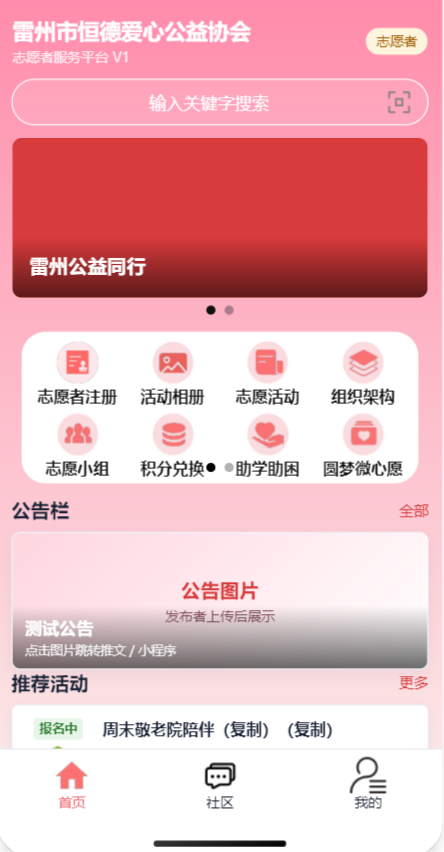
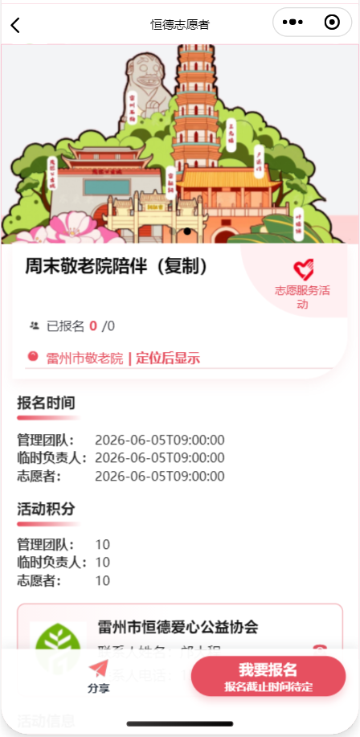
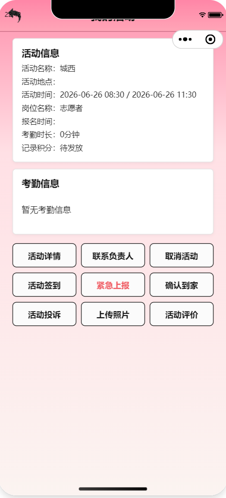
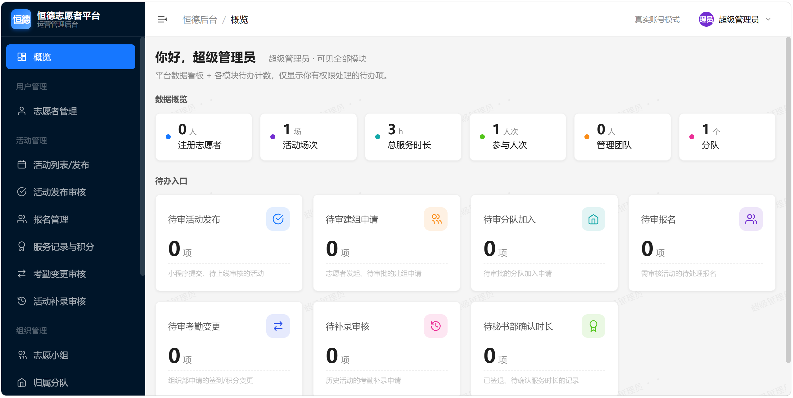
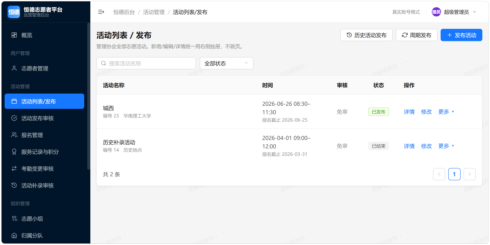
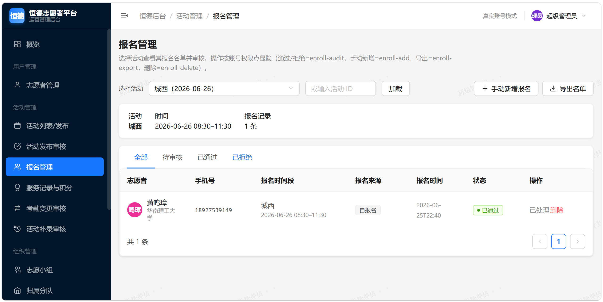
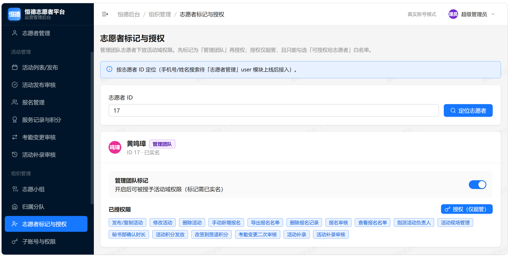
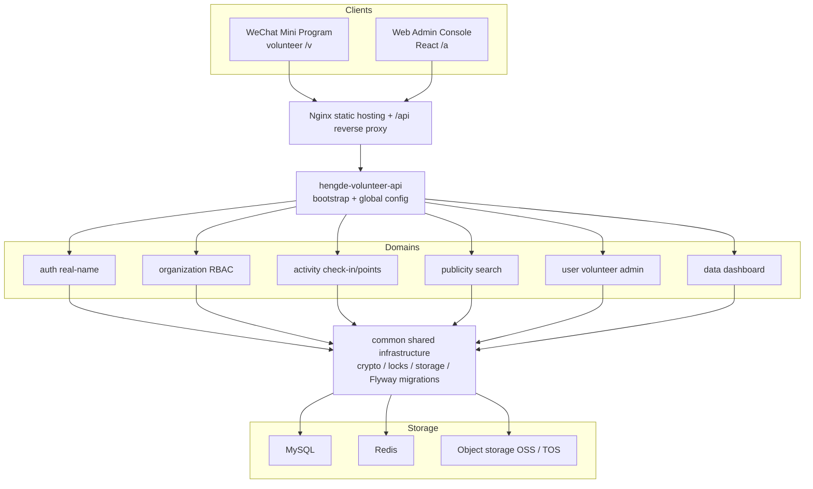

# Hengde Volunteer Management Platform

> A multi-client volunteer service system for non-profit organizations: WeChat Mini Program (volunteer client) + Web admin console + a Spring Boot 4 modular backend.
>
> Designed and built for the Leizhou Hengde Charity Association. Covers the full business loop — real-name registration, activity publishing and enrollment, GPS check-in, service-hour and points accounting, organizational structure with role-based sub-accounts, and public information / global search.

<p>
  
  
  
  
  
  
  
  
  
</p>

📖 **[中文版 README](README.md)** · English

---

## Table of Contents

- [Overview](#overview)
- [Preview](#preview)
- [Tech Stack](#tech-stack)
- [Architecture](#architecture)
- [Core Features](#core-features)
- [Engineering Highlights](#engineering-highlights)
- [Modules](#modules)
- [Getting Started](#getting-started)
- [Project Layout](#project-layout)
- [API Documentation](#api-documentation)
- [Project Status](#project-status)

---

## Overview

A **white-label, reusable** digitalization solution for charity organizations, spanning three clients:

| Client | Form | Users |
|---|---|---|
| Volunteer client | WeChat Mini Program (native) | Volunteers / Guests |
| Admin console | Web console (React) | Association management teams |
| Backend | Spring Boot 4 modular monolith | — |

It fully implements the volunteer-service loop — **"real-name registration → join a group/squad → enroll in activities → GPS check-in → unified check-out & hour calculation → secretary confirmation → points award"** — together with organizational management, fine-grained role-based sub-account permissions (RBAC), public information & global search, and analytics dashboards.

> Architecturally it follows a **domain-vertical modular monolith**: every business domain is an independent jar with its own three-layer structure, leaving clean boundaries for a smooth evolution toward microservices. It also supports **white-label multi-tenancy** — each organization runs an isolated database and configuration against the same artifact.

---

## Preview

> 📸 Screenshot placeholders — drop the images at the paths below and they render automatically.

### WeChat Mini Program (Volunteer Client)

| Home | Activity & Enroll | GPS Check-in | My Service Records |
|:---:|:---:|:---:|:---:|
|  |  |  |  |

### Web Admin Console

| Dashboard | Activity Mgmt | Enroll / Review | Sub-accounts & RBAC |
|:---:|:---:|:---:|:---:|
|  |  |  |  |

<!--
Screenshot setup:
1. Create a docs/screenshots/ folder at the repo root;
2. Add images with the file names above (PNG/JPG, names must match);
3. Mini-program shots: phone portrait; admin shots: ~1280px wide;
4. Delete any cell you don't need.
-->

---

## Tech Stack

| Category | Technologies |
|---|---|
| Core framework | Spring Boot 4.0.6 · Spring Cloud 2025 · Spring Cloud Alibaba · Java 17 |
| Auth | Sa-Token 1.43 (dual `StpLogic` isolating volunteer/admin sessions) · JWT (jjwt) |
| Persistence | MyBatis-Plus 3.5.16 · MySQL 8 · HikariCP · Flyway (DB migrations) |
| Cache / concurrency | Redis 7.4 · Redisson 4.4 (distributed locks, watchdog auto-renewal) |
| Object storage | Aliyun OSS / Volcengine TOS / MinIO (pluggable) |
| Messaging / 3rd-party | Volcengine SMS · WeChat Mini Program login · WeCom group membership check |
| Documents | EasyExcel + Apache POI (bulk import/export) · iText (certificates) · ZXing (QR codes) |
| API docs | springdoc-openapi + Knife4j (groups: volunteer / admin / enterprise) |
| Engineering | MapStruct (DTO mapping) · Lombok · Hutool · Sentinel (rate limiting) · XXL-Job (scheduling) |
| Testing | JUnit 5 + Testcontainers (real MySQL / Redis containers, not H2) |
| Frontend | WeChat Mini Program (native) · React (admin console, build-less / static-served) |
| Deployment | Nginx (static hosting + `/api` reverse proxy) · systemd · env-var startup guard |

---

## Architecture



**Design principles:**

- **Domain vertical slicing**: the parent project only manages dependencies; each domain module bundles its own `controller / service / dao / entity` layers. `hengde-volunteer-api` depends on all domain modules, holds the single bootstrap class, and is the only deployable unit.
- **Shared capabilities pushed down**: result/exception types, crypto, distributed locks, object storage, SMS, pagination, and the test harness all live in `common`, avoiding circular dependencies.
- **Centralized DB migrations**: Flyway scripts live in `common` (a single global version sequence, currently V1→V19); both the api runtime and every module's tests obtain the scripts via dependency and auto-provision the schema.

---

## Core Features

<table>
<tr><td valign="top" width="50%">

**🙋 Volunteer Client (Mini Program `/v`)**

- WeChat login → ID two-factor real-name verification → agreement reading + handwritten signature
- Create/join/leave volunteer groups, squad membership
- Browse activities, enroll / cancel, **proxy-enroll for same-group members**
- Eligibility checks (age / grade / gender / past sessions / service-hour threshold)
- **Self-service GPS check-in**, arrived-home confirmation, two-way reviews, activity messages
- My activities, my service records & points
- "Management-team" volunteers can publish activities in-app (subject to review)
- Browse public info, global search

</td><td valign="top" width="50%">

**🛠️ Admin Console (`/a`)**

- Account login (anti-brute-force), permission-code-driven dynamic menus/buttons
- Activity publish/edit/copy, **recurring publishing**, historical activities, **publish review**
- Enrollment management (review / manual add / Excel export)
- On-site leader assignment, attendance/points confirmation, attendance-change re-review, activity backfill
- Volunteer management (multi-filter list / detail / disable-restore / export)
- Organizational structure, group/squad management & approval
- Sub-accounts & fine-grained permission assignment, "management-team" flagging & granting
- Banners/announcements/files publicity, dashboard & to-dos

</td></tr>
</table>

---

## Engineering Highlights

> The most representative engineering work — good talking points for interviews.

### 🔐 Security & Authentication

- **Dual-domain RBAC**: two mutually isolated Sa-Token `StpLogic` instances — the volunteer client (`/v`) and admin console (`/a`) have independent sessions and cannot cross permissions. The admin side uses fine-grained "permission points" (super-admins get the `*` wildcard). Since V18, a subset of activity-domain permissions is extended to the volunteer side, wiring up the chain "grant → permission codes in the volunteer token → `@SaCheckPermission` enforced on the mini-program side", so "management-team" volunteers can manage/publish activities in-app.
- **PII field encryption**: ID numbers and phone numbers are stored as **AES-GCM ciphertext + an HMAC searchable hash** in dual columns — encrypted at rest yet still exact-searchable by phone/ID (e.g., locating a volunteer during activity backfill) without decryption.
- **Multi-dimensional abuse prevention**: SMS codes are rate-limited atomically by "per-number daily quota across scenarios + source-IP hourly/daily quota", with codes invalidated after too many wrong attempts; admin login is protected against brute force by both "account-level lockout" and "IP-level spray cap" (Redis INCR counters).
- **Config safety & startup guard**: all keys/switches use the `${ENV_VAR:dev-default}` form, with production config excluded by `.gitignore`; `ProductionConfigGuard` **fail-fast rejects startup** under the prod profile if weak default keys, the dev-login switch, etc. are detected — preventing silent go-live with dev config.

### ⚡ Concurrency & Consistency

- **Centralized lock discipline**: contention scenarios (enrollment, group create/join) all delegate to `common`'s `DistributedLockSupport` (Redisson), which centralizes the deadlock-safe discipline — "acquire in sorted/deduped order → release in reverse → only unlock if `isHeldByCurrentThread` → watchdog renewal". Each use case reuses it with a distinct key prefix (`lock:enroll:volunteer:` / `lock:group:volunteer:`).
- **Atomic batch operations**: same-group proxy enrollment uses `runLockedMany` (multi-lock, sorted & deduped by id) within a single transaction, so a batch enroll either fully succeeds or fully fails.
- **CAS conditional updates**: enrollment review, attendance-change review, and activity-publish review all use optimistic conditional updates (`WHERE status = old`) to prevent concurrent overwrites, backed by DB unique constraints enforcing "one person per group" and "one attendance row per activity".

### 📋 Domain Modeling

- **Service-hour & points engine**: GPS check-in (Haversine distance to the activity coordinates + a time window) → unified check-out & hour calculation → secretary confirmation → points award, forming a CAS state machine; points = base × role multiplier (leader 1.4 / management-team 1.2 / regular 1.0) × violation factor, with leave/absence scoring 0.
- **Activity publish-review loop**: activities submitted from the mini program land in a "pending review" state invisible to volunteers and must be approved in the console before going live; all id-based regular write actions reject activities under review to prevent bypassing approval (the permission boundary is centralized in `ActivityStatus.isUnderReview`).
- **Cross-module read-only aggregation**: each domain exposes only read-only services (e.g., `VolunteerQueryService` / `GroupQueryService` / `ActivityStatsService`); consumers call interfaces rather than reaching into foreign tables, and batch queries eliminate N+1.

### 🧪 Engineering Practices

- **Real-container integration tests**: a uniform `@SpringBootTest` + Testcontainers spins up **real MySQL / Redis** (no H2, avoiding dialect & migration incompatibilities); Flyway runs real migrations in the container DB, keeping tests close to production behavior.
- **Versioned database**: Flyway with a single global version sequence (V1→V19) centrally manages schema and permission-point seeds, keeping evolution traceable.
- **Production-ready deployment**: Nginx split deployment (static hosting + same-origin `/api` reverse proxy, no runtime CORS), systemd unit, env-var template, three-tier upload size alignment (nginx 16M > Spring 12M > business validation 10M), plus a complete deployment guide and go-live checklist.

---

## Modules

| Module | Responsibility |
|---|---|
| `hengde-volunteer-common` | Shared infrastructure: result/exception/error codes, crypto (AES-GCM + HMAC), Redis, distributed-lock helper, SMS, object storage, Excel, pagination, global-search aggregation, Flyway migrations, Testcontainers test harness |
| `hengde-volunteer-auth` | Auth: WeChat login / real-name registration / agreement signature, admin account login / password recovery (anti-brute-force), volunteer PII crypto, cross-module read-only queries |
| `hengde-volunteer-organization` | Organization: sub-accounts / RBAC, volunteer groups (create/approve/transfer/dissolve/import), squad membership, org structure, "management-team" flagging & granting |
| `hengde-volunteer-activity` | Activity: publish/edit/copy/recurring/historical, enroll/proxy-enroll, check-in/hours/points loop, on-site leaders, attendance-change review, activity backfill, publish review, activity messages |
| `hengde-volunteer-publicity` | Publicity: banners / announcements / file downloads, volunteers see only published items |
| `hengde-volunteer-user` | Volunteer management (admin): multi-filter list/detail/edit/disable-restore/export |
| `hengde-volunteer-data` | Dashboard: cross-domain read-only aggregation (registrations / activity sessions / service hours / participations / management-team / squads) |
| `hengde-volunteer-api` | Bootstrap + global config (Sa-Token / CORS / Jackson / pagination interceptor / global exceptions / API docs / generic upload), the single deployable unit |

> See [`文档/功能清单.md`](文档/功能清单.md) for the full feature × status matrix.

---

## Getting Started

### Prerequisites

- JDK 17
- MySQL 8+, Redis 7+
- Docker (only for integration tests via Testcontainers)
- Maven 3.9+ (a Maven Wrapper is bundled — use `./mvnw`)

### Build & Run

> Run all Maven commands from the parent project dir `代码/hengde-volunteer-parent/`. Modules resolve each other via the local repository, so re-`install` a dependency module after changing it.

```bash
cd 代码/hengde-volunteer-parent

# 1) Install the parent POM to the local repository
./mvnw install -N

# 2) Build & install modules in dependency order (common → auth → organization → activity → publicity → user → data)
./mvnw clean install -DskipTests -f ../hengde-volunteer-common/pom.xml
# ...repeat for the remaining domain modules

# 3) Run the app (requires MySQL / Redis; use the dev profile locally)
./mvnw spring-boot:run -f ../hengde-volunteer-api/pom.xml -Dspring-boot.run.profiles=dev
```

The app listens on `http://localhost:8080` by default, with context-path `/api`.

### Run Tests

```bash
# Run a module's full test suite (requires local Docker)
./mvnw test -f ../hengde-volunteer-activity/pom.xml
```

> For local development you can enable "dev login" (`POST /v/auth/login/dev`, skipping the WeChat code-to-openid exchange); it is force-disabled in production by the startup guard. For production deployment, see [`文档/v1/部署说明.md`](文档/v1/部署说明.md).

---

## Project Layout

```
.
├── 代码/                          # Backend Maven multi-module project
│   ├── hengde-volunteer-parent/   # Parent (dependency management)
│   ├── hengde-volunteer-common/   # Shared infrastructure + Flyway migrations
│   ├── hengde-volunteer-auth/     # Auth
│   ├── hengde-volunteer-organization/ # Organization / RBAC
│   ├── hengde-volunteer-activity/ # Activity / check-in / points
│   ├── hengde-volunteer-publicity/# Publicity / search
│   ├── hengde-volunteer-user/     # Volunteer management
│   ├── hengde-volunteer-data/     # Dashboard
│   └── hengde-volunteer-api/      # Bootstrap + global config (deployable unit)
├── hengde-volunteer-miniprogram/  # WeChat Mini Program source (volunteer client)
├── volunteer-platform-back/       # Web admin console frontend (React)
├── 部署/                          # nginx.conf / systemd unit / env-var template
└── 文档/                          # Requirements, API, deployment, self-test docs
```

---

## API Documentation

The backend integrates springdoc-openapi + Knife4j. After startup:

- Knife4j docs: `http://localhost:8080/api/doc.html`
- Groups: `volunteer` (`/v/**`), `admin` (`/a/**`), `enterprise` (`/e/**`, reserved)

API paths follow the `/{role}/{domain}/{resource}/{action?}` convention; the full endpoint table is in [`文档/v1/url文档v1.md`](文档/v1/url文档v1.md).

---

## Project Status

- ✅ **V1 core complete**: auth, organization/RBAC, the full activity loop (incl. check-in/hours/points), publicity/search, volunteer management, and the dashboard — all backed by Testcontainers integration tests; the admin console frontend is wired to real APIs; production deployment artifacts and docs are ready.
- 🚧 **Pending go-live**: deployment-ready, awaiting the association's production server and WeChat Mini Program appid for the official launch (real-name verification, WeCom group checks and other third-party capabilities are behind ready-to-enable switches).
- 🗺️ **Roadmap (future versions)**: corporate sponsors, a points mall / donations, community interaction, an honors/role-model system, and a SaaS supervision console for one-click multi-organization onboarding.

---

<sub>An independently developed management platform for charity organizations, with a fully designed and implemented tech stack and architecture. For implementation details, see [`文档/`](文档/).</sub>
