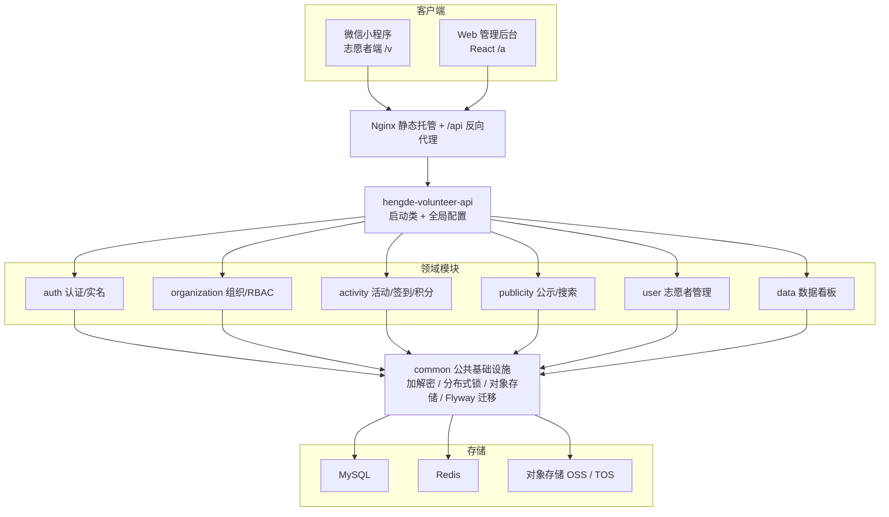

# 恒德志愿者管理平台

> 面向社会公益组织的多端志愿者服务系统：微信小程序（志愿者端）+ Web 管理后台 + Spring Boot 4 微服务化后端。
>
> 为雷州市恒德爱心公益协会设计开发，覆盖志愿者实名注册、活动发布与报名、GPS 签到、服务时长与积分核算、组织架构与子账号权限、信息公示等完整业务闭环。

<p>
  
  
  
  
  
  
  
  
  
</p>

中文 · **[English README](README.en.md)**

---

## 目录

- [项目简介](#项目简介)
- [功能预览](#功能预览)
- [技术栈](#技术栈)
- [系统架构](#系统架构)
- [核心功能](#核心功能)
- [技术亮点](#技术亮点)
- [模块结构](#模块结构)
- [快速开始](#快速开始)
- [目录结构](#目录结构)
- [接口文档](#接口文档)
- [项目状态](#项目状态)

---

## 项目简介

恒德志愿者管理平台是一套**白标可复用**的公益组织数字化解决方案，包含三端：

| 端 | 形态 | 使用者 |
|---|---|---|
| 志愿者端 | 微信小程序（原生） | 志愿者 / 游客 |
| 管理后台 | Web 控制台（React） | 协会各部门管理团队 |
| 后端服务 | Spring Boot 4 模块化单体 | —— |

业务上完整实现了**「实名注册 → 加入小组/分队 → 报名活动 → GPS 签到 → 统一签退算时长 → 秘书部确认 → 积分发放」**的志愿服务全流程闭环，并配套了组织架构管理、细粒度子账号权限（RBAC）、信息公示与全局搜索、数据看板等运营能力。

> 架构上按「领域垂直切分的模块化单体」组织，每个业务领域是独立 jar、内部自带三层结构，预留了向微服务平滑演进的边界；同时支持「白标多实例」部署——每个公益组织一套独立库与配置、跑同一份制品。

---

## 功能预览

### 微信小程序（志愿者端）

| 首页 | 活动详情与报名 | GPS 签到 |
|:---:|:---:|:---:|
|  |  |  |

### Web 管理后台

| 数据看板 | 活动管理 | 报名 / 审核 | 子账号与权限 |
|:---:|:---:|:---:|:---:|
|  |  |  |  |

---

## 技术栈

| 分类 | 技术选型 |
|---|---|
| 基础框架 | Spring Boot 4.0.6 · Spring Cloud 2025 · Spring Cloud Alibaba · Java 17 |
| 认证授权 | Sa-Token 1.43（双域 StpLogic 隔离志愿者端/后台端）· JWT（jjwt）|
| 持久层 | MyBatis-Plus 3.5.16 · MySQL 8 · HikariCP · Flyway（数据库版本迁移）|
| 缓存 / 并发 | Redis 7.4 · Redisson 4.4（分布式锁，watchdog 自动续期）|
| 对象存储 | 阿里云 OSS / 火山引擎 TOS / MinIO（可插拔）|
| 消息 / 第三方 | 火山引擎短信 · 微信小程序登录 · 企业微信群校验 |
| 文档处理 | EasyExcel + Apache POI（批量导入导出）· iText（电子证书）· ZXing（二维码）|
| 接口文档 | springdoc-openapi + Knife4j（分组：volunteer / admin / enterprise）|
| 工程化 | MapStruct（DTO 映射）· Lombok · Hutool · 限流（Sentinel）· XXL-Job（定时任务）|
| 测试 | JUnit 5 + Testcontainers（真实 MySQL / Redis 容器，非 H2）|
| 前端 | 微信小程序原生 · React（管理后台，无构建 / 静态托管）|
| 部署 | Nginx（静态托管 + `/api` 反向代理）· systemd · 环境变量启动守卫 |

---

## 系统架构



**设计要点：**

- **领域垂直切分**：父工程仅做依赖管理，下挂各领域模块，每个模块内部自带 `controller / service / dao / entity` 三层；`hengde-volunteer-api` 依赖全部领域模块、持有唯一启动类，是唯一可部署单元。
- **公共能力下沉**：返回体/异常、加解密、分布式锁、对象存储、短信、分页、测试基座等统一沉到 `common`，避免循环依赖。
- **数据库迁移集中**：Flyway 脚本集中在 `common`（全局唯一版本序列，目前 V1→V23），api 运行期与各模块测试都经依赖拿到脚本自动建表。

---

## 核心功能

<table>
<tr><td valign="top" width="50%">

**🙋 志愿者端（小程序 `/v`）**

- 手机号验证码/密码登录（微信登录并存）→ 实名注册 → 协议阅读 + 手写签名
- 志愿小组发起/加入/退出、分队归属
- 活动浏览、按场次报名 / 取消、**同小组互相代报名**
- 资格校验（年龄 / 年级 / 性别 / 已参加场次 / 服务时长门槛）
- **扫码 + GPS 签到/签退**、确认到家、双向评价、活动留言
- 我的活动、我的服务记录与积分、我的资料（编号/改绑手机/头像）
- 「管理团队」志愿者可在小程序内发布**多场次**活动（走审核）
- **报名管理团队**（问卷申请 + 后台审核）、信息公示浏览、全局搜索

</td><td valign="top" width="50%">

**🛠️ 管理后台（`/a`）**

- 账号登录（防爆破）、基于权限码的菜单/按钮动态渲染
- 活动发布/编辑/复制（**多场次 + 服务保障**）、**周期发布**、历史活动、**发布审核**
- 报名管理（审核/手动新增/Excel 导出）
- 现场负责人指派（报名志愿者/管理团队两页签选人）、考勤/积分确认、考勤变更二次审核、活动补录
- 志愿者管理（多条件筛选/详情/停用恢复/导出/清空式重置密码）
- 组织架构、小组/分队管理与审批、**报名管理团队审核**
- 子账号与细粒度权限分配、「管理团队」标记与授权
- 轮播图/公告/文件公示、数据看板与待办

</td></tr>
</table>

---

## 技术亮点

> 以下是项目中较有代表性的工程实现，也是简历可着重展开的点。

### 🔐 安全与认证

- **双域 RBAC 鉴权**：基于 Sa-Token 配置两套相互隔离的 `StpLogic`——志愿者端（`/v`）与管理后台（`/a`）独立登录态、互不串权；后台采用「权限点（permission）」细粒度控制，超管走 `*` 通配；V18 起把活动域权限子集扩展到志愿者端，打通「授权 → 志愿者 token 带权限码 → `@SaCheckPermission` 在小程序端生效」链路，让「管理团队」志愿者可在小程序内管理/发布活动。
- **PII 字段加密**：身份证、手机号等敏感信息采用 **AES-GCM 密文 + HMAC 可查询哈希** 双列存储——既保证落库加密，又支持按手机号/身份证精确检索（如活动补录定位志愿者）而无需解密。
- **多维度防滥用**：短信验证码按「同号跨场景日限量 + 来源 IP 时/日限量」原子计数限流、同码错满次数作废；后台登录按「账号维度锁定 + IP 维度喷洒上限」双重防爆破（Redis INCR 计数）。
- **配置安全与启动守卫**：所有密钥/开关均为 `${ENV_VAR:dev默认值}` 形式，生产配置由 `.gitignore` 排除；`ProductionConfigGuard` 在 prod profile 下对弱默认密钥、开发登录开关等 **fail-fast 拒绝启动**，杜绝以开发配置静默上线。

### ⚡ 高并发与一致性

- **分布式锁纪律收敛**：报名、建组/加入等竞态场景统一委托 `common` 的 `DistributedLockSupport`（Redisson），集中实现「升序去重加锁 → 反序释放 → `isHeldByCurrentThread` 才解锁 → watchdog 续期」的死锁安全纪律；各业务以不同 key 前缀复用（`lock:enroll:volunteer:` / `lock:group:volunteer:`）。
- **批量原子操作**：同小组代报名用 `runLockedMany`（按 id 升序去重多锁）+ 单事务，保证批量报名要么全成要么全败。
- **CAS 条件更新**：报名审核、考勤变更审核、活动发布审核等状态流转均用乐观条件更新（`WHERE status = 旧值`）防并发覆盖，配合数据库唯一约束兜底「一人一组」「一活动一考勤行」。

### 📋 业务建模

- **服务时长与积分引擎**：GPS 签到（Haversine 距活动坐标判定 + 时间窗口）→ 统一签退算时长 → 秘书部确认 → 积分发放，形成 CAS 状态机；积分 = 基数 × 角色倍率（负责人 1.4 / 管理团队 1.2 / 普通 1.0）× 违规系数，请假/缺席记 0。
- **活动发布审核闭环**：小程序提交的活动落「待审核」态、志愿者端不可见，须后台审核才上线；并对所有按 id 的常规写动作拦截审核态活动，防止绕过审核上线（权限边界统一收敛到 `ActivityStatus.isUnderReview`）。
- **跨模块只读聚合**：各领域对外只暴露只读 service（如 `VolunteerQueryService` / `GroupQueryService` / `ActivityStatsService`），消费方只调接口不直接捅外域表，且批量查询消除 N+1。

### 🧪 工程化

- **真实容器集成测试**：统一 `@SpringBootTest` + Testcontainers 拉起**真实 MySQL / Redis**（不用 H2，避免方言与迁移不兼容），Flyway 在容器库跑真实迁移，测试贴近生产行为。
- **数据库版本化**：Flyway 单一全局版本序列（V1→V23）集中管理表结构与权限点种子，演进可追溯。
- **生产部署就绪**：Nginx 分离部署（前端静态托管 + `/api` 同源反代，无运行期 CORS）、systemd 单元、环境变量模板、上传体积三层对齐（nginx 16M > Spring 12M > 业务校验 10M），配套完整部署文档与上线 checklist。

---

## 模块结构

| 模块 | 职责 |
|---|---|
| `hengde-volunteer-common` | 公共基础设施：返回体/异常/错误码、加解密（AES-GCM + HMAC）、Redis、分布式锁助手、短信、对象存储、Excel、分页、全局搜索聚合、Flyway 迁移脚本、Testcontainers 测试基座 |
| `hengde-volunteer-auth` | 认证：手机号验证码/密码登录体系（V20）、微信登录、实名注册/协议签名、后台账号登录/找回密码（防爆破）、志愿者 PII 加解密、跨模块只读查询 |
| `hengde-volunteer-organization` | 组织：子账号 / RBAC 权限、志愿小组（发起/审批/转移/解散/导入）、分队归属、组织架构、「管理团队」标记与授权 |
| `hengde-volunteer-activity` | 活动：发布/编辑/复制/周期发布/历史活动、报名/代报名、签到/时长/积分闭环、现场负责人、考勤变更审核、活动补录、发布审核、活动留言 |
| `hengde-volunteer-publicity` | 公示：轮播图 / 公告 / 文件下载，志愿者端只读已发布 |
| `hengde-volunteer-user` | 用户域：后台志愿者管理（多条件列表/详情/修改/停用恢复/导出/重置密码）+ 志愿者端「我的资料」（编号/可改项/手机号改绑）|
| `hengde-volunteer-data` | 数据看板：跨域只读聚合（注册数/活动场次/服务时长/参与人次/管理团队/分队数）|
| `hengde-volunteer-api` | 启动类 + 全局配置（Sa-Token / CORS / Jackson / 分页拦截器 / 全局异常 / 接口文档 / 通用上传），唯一可部署单元 |

> 完整的功能 × 完成状态对照见 [`文档/功能清单.md`](文档/功能清单.md)。

---

## 快速开始

### 环境要求

- JDK 17
- MySQL 8+、Redis 7+
- Docker（仅运行集成测试时需要，用于 Testcontainers）
- Maven 3.9+（项目自带 Maven Wrapper，可用 `./mvnw`）

### 构建与运行

> 所有 Maven 命令在父工程目录 `代码/hengde-volunteer-parent/` 下执行。各模块经本地仓库解析依赖，被依赖模块改动后需先 `install`。

```bash
cd 代码/hengde-volunteer-parent

# 1) 全量构建（父 POM 已聚合全部 8 个模块，按依赖序自动构建；
#    构建完核对 Reactor Summary 列满 parent + 8 模块）
./mvnw clean install -DskipTests

# 2) 启动应用（需 MySQL / Redis 在线，本地开发用 dev profile）
./mvnw spring-boot:run -f ../hengde-volunteer-api/pom.xml "-Dspring-boot.run.profiles=dev"
```

启动后默认监听 `http://localhost:8080`，context-path 为 `/api`。

### 运行测试

```bash
# 运行某模块全部测试（需本机 Docker）
./mvnw test -f ../hengde-volunteer-activity/pom.xml
```

> 本地开发可开启「开发登录」（`POST /v/auth/login/dev`，跳过微信 code 换 openid）联调；生产环境由启动守卫强制关闭。生产部署详见 [`文档/v1/部署说明.md`](文档/v1/部署说明.md)。

---

## 目录结构

```
.
├── 代码/                          # 后端 Maven 多模块工程
│   ├── hengde-volunteer-parent/   # 父工程（依赖管理）
│   ├── hengde-volunteer-common/   # 公共基础设施 + Flyway 迁移
│   ├── hengde-volunteer-auth/     # 认证
│   ├── hengde-volunteer-organization/ # 组织 / RBAC
│   ├── hengde-volunteer-activity/ # 活动 / 签到 / 积分
│   ├── hengde-volunteer-publicity/# 公示 / 搜索
│   ├── hengde-volunteer-user/     # 志愿者管理
│   ├── hengde-volunteer-data/     # 数据看板
│   └── hengde-volunteer-api/      # 启动类 + 全局配置（可部署单元）
├── hengde-volunteer-miniprogram/  # 微信小程序源码（志愿者端）
├── volunteer-platform-back/       # Web 管理后台前端（React）
├── 部署/                          # nginx.conf / systemd 单元 / 环境变量模板
└── 文档/                          # 需求、接口、部署、自测等文档
```

---

## 接口文档

后端集成 springdoc-openapi + Knife4j，启动后访问：

- Knife4j 文档：`http://localhost:8080/api/doc.html`
- 分组：`volunteer`（`/v/**`）、`admin`（`/a/**`）、`enterprise`（`/e/**`，预留）

接口路径遵循 `/{角色}/{领域}/{资源}/{动作?}` 约定，完整端点表见 [`文档/v1/url文档v1.md`](文档/v1/url文档v1.md)。

---

## 项目状态

- ✅ **V1 核心已完成**：认证（含手机号登录体系）、组织/RBAC（含报名管理团队问卷审核）、活动全流程（多场次发布、服务保障、签到/时长/积分闭环、发布审核）、公示/搜索、志愿者管理与我的资料、数据看板，后端均带 Testcontainers 集成测试（迁移至 V23）；管理后台前端已全页面对接真实接口并完成生产硬化。
- 🚧 **待上线**：已具备生产部署能力，待协会方提供生产服务器与微信小程序 appid 后正式上线（实名核验、企业微信群校验等第三方能力已留好接入开关）。
- 🗺️ **规划中（后续版本）**：爱心企业、积分商城/捐赠、社区互动、荣誉榜样，以及面向多组织一键开通的 SaaS 监管后台。

---

<sub>本项目为个人独立开发的公益组织管理平台，技术栈与架构均为完整设计实现。更多实现细节欢迎查阅 [`文档/`](文档/)。</sub>
